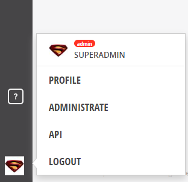
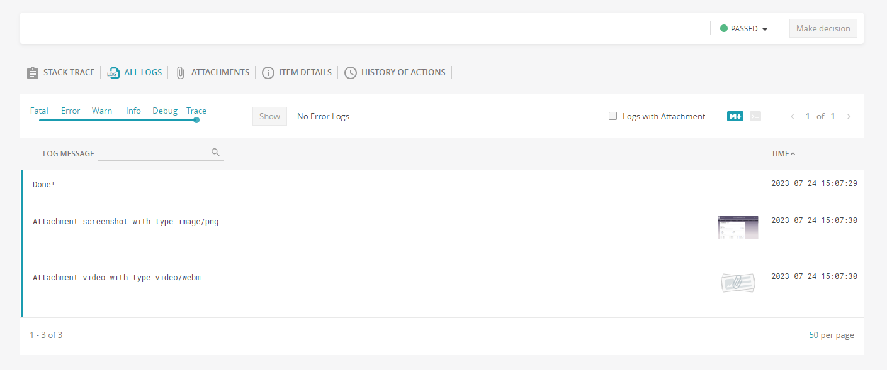

To run the test project on your machine, please follow the following step-by-step guidelines.

## Prerequisites:
- Node.js version 18 or above
- Ubuntu 20.04 machine
- docker and docker compose are ready to use
- Have at least 5GB of RAM to run host the report portal service which is for storing the test report

## Step 1: Run the following command to create a new Playwright project with Node.js and Typescript

```bash
npm install
npm run setup
```

## Step 2: Bring up the report portal service

We will store the test report using [report portal](https://reportportal.io/). This allows us to see all the reports of all the tests that have been executed.
There are two ways to set up the report portal service community version. One is using Kubernetes, one is using Docker. Let's use Docker to keep the test project simple. If you're considering using report portal service, please use Kubernetes which is better for scalability.

Run the following command to bring up the report portal service from the root directory of the project:

```bash
docker compose up -d
```


## Step 3: Run the test

1. Get the apiKey of the report portal.
Open up your browser and navigate to `http://localhost:8082`, then login with the following admin credentials

```txt
username: superadmin
password: erebus
```

Click on admin icon at the left bottom of the screen --> choose `Profile`.



Then export the access token to the `RP_TOKEN` environment using the following command:

```bash
export RP_TOKEN='your_admin_token'
```

2. Run the test

To run the test on headed mode using Chrome browser, run the following command:

```bash
npm run test-headed
```

To run the test on headless mode using Chrome browser, run the following command:

```bash
npm run test-headless
```

You should see the `weather-of-cities.csv` file created at the root directory. Inside that file, all the information of the weather for `Singapore` in the next 15 days will be shown.

```csv
City Name,Date,Temperature C Day,Temperature F Day,Humidity Day,Temperature C Night,Temperature F Night,Humidity Night
Singapore,Mon 24,,,,27°,81°,8%
Singapore,Tue 25,32°,90°,17%,27°,81°,17%
Singapore,Wed 26,31°,89°,24%,27°,81°,23%
Singapore,Thu 27,31°,88°,32%,27°,81°,22%
Singapore,Fri 28,30°,87°,48%,27°,80°,66%
Singapore,Sat 29,30°,86°,61%,27°,80°,56%
Singapore,Sun 30,30°,87°,69%,27°,80°,45%
Singapore,Mon 31,30°,86°,68%,27°,80°,44%
Singapore,Tue 01,30°,87°,54%,27°,80°,51%
Singapore,Wed 02,30°,86°,60%,26°,80°,58%
Singapore,Thu 03,30°,87°,60%,26°,80°,60%
Singapore,Fri 04,30°,87°,24%,27°,80°,60%
Singapore,Sat 05,30°,87°,60%,26°,79°,56%
Singapore,Sun 06,30°,87°,24%,26°,79°,35%
Singapore,Mon 07,30°,87°,57%,26°,79°,38%

```

You can see the test report at report portal page by navigating to `localhost:8082` -> choose `Launches` on the menu:



## Step 4: Set the cronjob

There are two ways we can set the cronjob:
- Use the CI tools such as GitHub actions or Jenkins
- Set the cronjob directly in our local machine

Let's set the cronjob in the Ubuntu 20.04 machine.

1. Install and setup the cron

```bash
sudo apt update
sudo apt install cron
sudo systemctl enable cron
```

Edit the execute.sh file with your own values:

```bash
#!/bin/bash
export RP_TOKEN=your_token
cd /your/project/path
npm run test-headless
```

Make the file executable

```bash
chmod +x execute.sh
```

2. Edit the crontab

```bash
crontab -e
```

Choose option 2 as `/usr/bin/vim.basic`

add the following content to the opened file.

```bash
0 * * * * /your/path/to/project/directory/execute.sh
```

Save the file

Note: If you're using nvm (node version manager), you need to add the nvm path to your `execute.sh` script like below:


```
#!/bin/bash
PATH="/root/.nvm/versions/node/v18.17.0/bin/:$PATH"
export RP_TOKEN=your_token
cd /your/project/path
npm run test-headless

```

3. View all crontab

```bash
crontab -l
```

You should see the similar output as below

```txt
0 * * * * /your/path/to/project/directory/execute.sh
```

And the test should be run automatically at every hour like 1:00, 2:00, 3:00.

